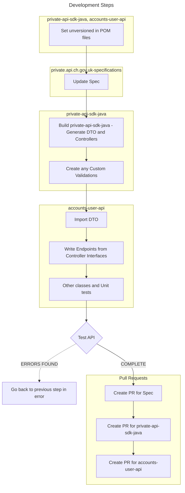

# Workflow for Updating the API Specification

Adopting an "API First" approach to development entails commencing with the specification and subsequently generating models and controller interfaces for utilization in our API project.

When modifications are made to the API specification, it involves working with three distinct projects:

- [private.api.ch.gov.uk-specifications](https://github.com/companieshouse/private.api.ch.gov.uk-specifications): This project encompasses the API specification (`accounts-user-api.yaml`).
- [private-api-sdk-java](https://github.com/companieshouse/private-api-sdk-java): Here, you'll find the generated models and controller interfaces, including any custom "Bean Validation" annotation interfaces and classes.
- This API repository.

During these changes, ensure to install `unversioned` Maven versions of both the `private.api.ch.gov.uk-specifications` and `private-api-sdk-java` repositories. Once content with the changes, proceed to create separate PRs for each project to obtain new build numbers in the sequence of `private.api.ch.gov.uk-specifications`, `private-api-sdk-java`, `accounts-user-api`.



## Set unversioned in POM files

- In the POM file of `private-api-sdk-java`, set the property `private.api.ch.gov.uk.version` to `unversioned`.
- In the POM file of `accounts-user-api`, set the property `private-api-sdk-java.version` to `unversioned` (this dependency imports the generated model files and controller interfaces. It also imports any custom validations used.

## Updating the API Specification in the `private.api.ch.gov.uk-specifications` Project

The API specification serves as the single source of truth for the API, initiating changes here rather than in the codebase.

Update the `accounts-user-api.yaml` and then proceed to build this project. This action installs an `unversioned` version of `private.api.ch.gov.uk-specifications` in your local Maven repository, which will be utilized by the `private-api-sdk-java` project.

``` bash
mvn clean install
```

## Building the private-api-sdk-java Project

This action installs an 'unversioned' version of private-api-sdk-java in your local Maven repository, to be used by the accounts-user-api project. The build generates model classes and controller interfaces from the specification. Custom "Bean Validation" can also be implemented in this project.

Note: Sometimes, the mvn install command might need to be executed again due to build imperfections.

``` bash
mvn clean install
mvn install # run if tests fail in previous step

```

## Complete other steps as per diagram

Stop when API testing is successful

## Creating a PR for the private.api.ch.gov.uk-specifications Project
In addition to the YAML file, there are typically associated Markdown files that the Maven build updates. Add these files and then initiate a PR.

Once approved:

Merge the changes.
Wait for 10 minutes for the release artifact to be generated on GitHub.
In the POM file of private-api-sdk-java, update the private.api.ch.gov.uk.version property to the new version number of the private.api.ch.gov.uk-specifications release from GitHub.

## Creating a PR for the private-api-sdk-java Project
Primarily, you need to add the files related to the accounts-user-api project (along with the updated version of the POM). Add these files and then create a PR.

Once approved:

Merge the changes.
Wait for 10 minutes for the release artifact to be generated on GitHub.
In the POM file of accounts-user-api, update the private-api-sdk-java.version property to the new version number of the private-api-sdk-java release from GitHub.
Currently, there are two main branches in this project, and both must be generated:

main - for Java 21
main-8 - for Java 8 and 11

## Creating a PR for the accounts-user-api Project
Conduct a final round of testing (ensuring the correct Maven properties are used for the version numbers of private.api.ch.gov.uk-specifications and private-api-sdk-java).

Initiate the PR for this project and merge once approved.

## References

- The original spike Confluence page is [here](https://companieshouse.atlassian.net/wiki/spaces/IDV/pages/4301848621/Spike+-+How+to+generate+OpenAPI+spec+from+existing+code).